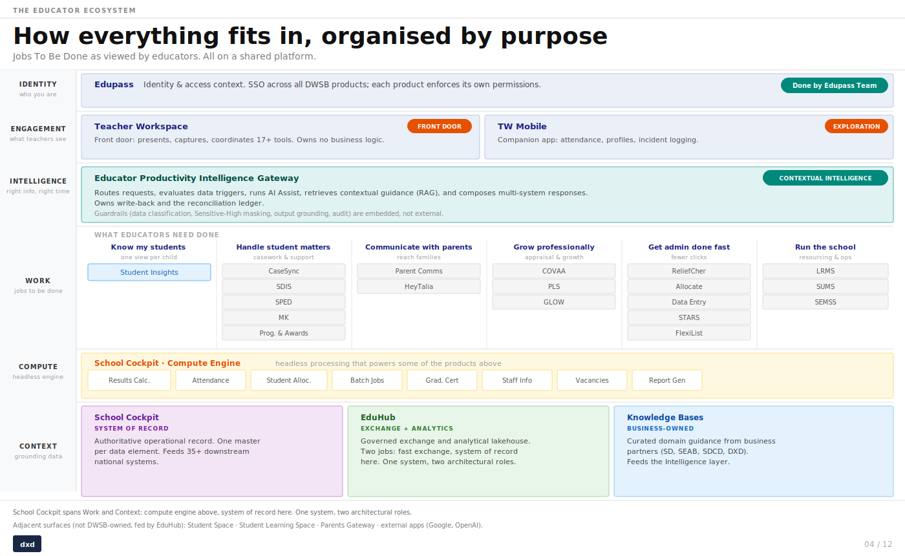

# TW Contextual Intelligence (CI)

## How CI fits into the educator ecosystem

CI sits in the **Intelligence** layer of the educator platform — the Educator Productivity Intelligence Gateway. It routes requests, evaluates data triggers, runs AI Assist, retrieves contextual guidance via RAG, and composes multi-system responses. Guardrails (data classification, Sensitive-High masking, output grounding, audit) are embedded, not external.

---

## CI Jobs-to-be-done (JTBD)

CI is a platform capability layer within Teacher's Workspace — intelligence woven into the workflows teachers are already in, surfaced at the point of need rather than sought out. Built on shared RAG and model services, it is designed to serve multiple teacher jobs-to-be-done over time as it matures.

**Knowledge retrieval & learning** *(current scope)*
Surface the right guidance at the moment a teacher needs it — grounded in official MOE materials, delivered in the flow of work without requiring a separate search. Pilot use case: student intervention support. Future use cases include exam operations guides, tools discovery, and finance & procurement.

**Insights summary** *(planned)*
Synthesise student or cohort patterns into an actionable brief — giving teachers a fast read on what matters without sifting through raw data.

**Drafting assistance** *(planned)*
Generate first drafts of communications, case notes, or reports — reducing documentation time so teachers can stay focused on students.

---

## PRDs

- [Product Requirements Document](./prd/TW%20Contextual%20Intelligence%20v1.0%20%E2%80%94%20Capability%20Layer%20+%20Knowledge%20Retrieval%20JTBD.md)
