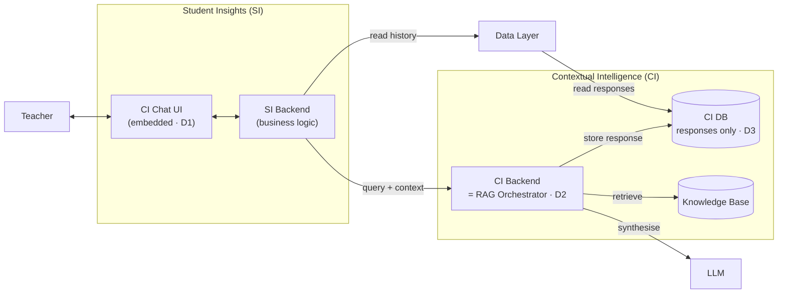
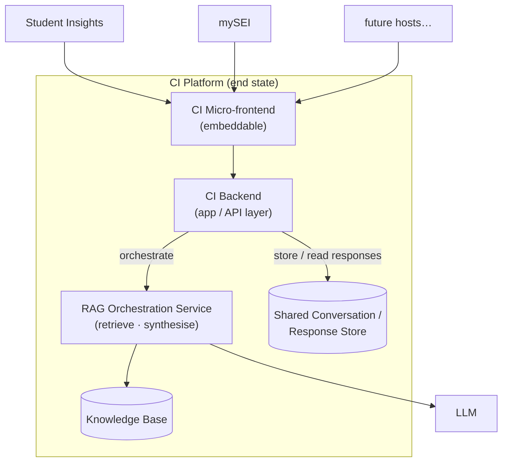

# 0001 — Contextual Intelligence (CI) Pilot Architecture

**Author(s):** Nicholas Lim (nicholas_lim@tech.gov.sg)

**Status:** Accepted — 2026-06-25

---

## Context

Contextual Intelligence (**CI**) is intended to be a **platform capability layer** — providing AI-assisted, context-grounded guidance, and serving multiple teacher jobs-to-be-done (knowledge retrieval first, later insights summary and drafting assistance) across multiple host surfaces over time.

For the **pilot**, the only consumer is **Student Insights (SI)**, the host application that embeds the CI chat experience. Building for a multi-host, multi-JTBD future *now* would add abstraction layers — a standalone micro-frontend, a generalised orchestration contract, a multi-tenant data model — that carry real cost (more integration surface, more to secure and operate) against a small team and a fixed pilot target.

We therefore need to decide, for the pilot, **where the chat frontend lives**, **what the CI backend is responsible for**, and **what the CI datastore owns** — while keeping a clear path to the platform end state so today's choices don't become tomorrow's rewrite. This ADR revisits the earlier assumption that CI would ship as a dedicated micro-frontend from the start: that is deferred, not cancelled (see [D1](#d1--build-the-ci-chat-frontend-inside-student-insights-si)).

A few terms used throughout:

- **CI (Contextual Intelligence)** — the capability layer providing context-grounded guidance.
- **SI (Student Insights)** — the host app embedding the CI chat for the pilot.
- **mySEI** — a separate app, used here only as a hypothetical *future* second host for CI.
- **RAG (Retrieval-Augmented Generation)** — retrieve relevant knowledge-base chunks, then synthesise a grounded answer with an LLM.
- **CI DB** — the CI-owned datastore; per this ADR it persists **LLM responses only** (the "Response Store" in the architecture diagram).
- **Data layer** — the shared data-access API (the "Data API" in the architecture diagram) through which host apps read persisted data.

---

## Decision

### D1 — Build the CI chat frontend inside Student Insights (SI)

The CI chat interface is built **within the SI application itself**, not as a separate, independently deployable CI micro-frontend.

- The pilot's only use case is SI; a shared micro-frontend has no second consumer to justify it yet.
- **Abstraction trigger:** carve the chat out into its own embeddable CI micro-frontend **only when a second host needs it** (e.g. mySEI). Until then, keep it in SI.

### D2 — The CI backend also plays the RAG orchestrator role

A single CI backend service owns both the application/API responsibilities and the **RAG orchestration** (context assembly → retrieval → LLM synthesis → response). They are not split into separate services for the pilot.

- One use case, one team, one deployable — splitting now buys complexity without a consumer that benefits.
- **Deployment:** for the pilot the CI backend is deployed within the **App Layer subnet** (see [`architecture/architecture.drawio`](../../architecture/architecture.drawio)), alongside the SI App and Data API, rather than in its own tier.
- **Abstraction trigger:** split RAG orchestration into a standalone, independently consumable service **only when other use cases / hosts arrive** that need it directly.

### D3 — CI DB stores LLM responses only; business logic stays in the host app

The CI DB persists **LLM responses only**. It is **not** the system of record for business logic.

- **Business logic lives in the respective host app** (currently only SI) — session semantics, what a "conversation" means, when context is updated, access control around the teacher's view, etc.
- **SI reads chat history from the CI DB via the data layer** (the read path), so the teacher can **continue a chat** or **update context**. SI does not talk to the CI DB directly; it goes through the shared data layer.
- The **write path** is owned by the CI backend: it is the only writer of LLM responses into the CI DB.

This cleanly separates the **write path** (CI backend → CI DB) from the **read path** (SI → data layer → CI DB), with the two meeting only at the CI DB.

---

## Data flow (current pilot state)

Logical view of the decisions above. (For the physical/deployment view see [`architecture/architecture.drawio`](../../architecture/architecture.drawio).)

- **Write path:** SI backend → CI backend → (knowledge base + LLM) → **CI backend stores the response in the CI DB**. The CI backend is the *only* writer (D3).
- **Read path:** to continue a chat or update context, SI reads prior responses (history) from the CI DB **through the data layer** — never directly, and not via the CI backend.
- The CI DB holds **only** LLM responses; business logic stays in SI (D3).

---

## End-state vision for CI

The pilot decisions are deliberately the *minimal* shape for a single host. The intended end state is CI as a **shared, multi-host, multi-JTBD platform**. Each pilot decision has a defined point at which it graduates toward that state.

| Concern | Pilot (this ADR) | End state | Graduation trigger |
|---------|------------------|-----------|--------------------|
| **Frontend (D1)** | Chat built inside SI | Standalone, embeddable **CI micro-frontend** consumed by many hosts | A second host needs CI (e.g. mySEI) |
| **Backend (D2)** | CI backend == RAG orchestrator (one service) | CI backend (app/API layer) remains, with **RAG orchestration extracted into a standalone, independently consumable service** behind a stable contract | A use case/host needs orchestration directly |
| **Data (D3)** | CI DB = responses only; business logic in SI; history read via data layer | Shared **conversation/response store** with per-host/tenant partitioning; consumers keep their own business logic | Multiple hosts persisting/reading conversations |
| **Scope** | Single JTBD (knowledge retrieval) | Multiple JTBDs (insights summary, drafting assistance) over shared CI primitives | Each new JTBD scoped separately |

**Guiding principle:** abstract on the *second* real consumer, not the first anticipated one. Each abstraction (micro-frontend, orchestration service, shared store) is introduced when a concrete second use case pays for it — keeping the pilot lean while ensuring the boundaries drawn today (host owns business logic; CI owns responses + orchestration; reads go through the data layer) are the same ones the platform will keep.

---

## Consequences

### Positive

- **Fastest path to pilot.** No micro-frontend extraction, no service split, no multi-tenant data model to build up front.
- **Clear ownership boundaries.** Business logic in the host (SI); responses + orchestration in CI; read access mediated by the data layer. These boundaries are end-state-compatible, so growth is *extraction*, not *rewrite*.
- **Single writer for CI DB.** Only the CI backend writes responses, keeping the persistence path simple and auditable (supports citation-coverage / guardrail logging).
- **Decoupled read path.** SI reading history through the data layer means CI backend availability is not on the critical path for displaying past conversations.

### Negative / risks

- **SI carries CI-specific logic.** Conversation/session semantics live in SI for now; a future second host (mySEI) cannot reuse them until D1/D2 graduate, creating a one-time extraction cost (and risk of SI-specific assumptions leaking in). *Mitigation:* keep the chat UI and CI-calling code reasonably self-contained within SI to ease later extraction.
- **Mixed responsibilities in the CI backend (D2).** App/API concerns and RAG orchestration share a deployable; scaling and failure isolation between them is coarse. Acceptable at pilot load.
- **Coupling via the data-layer schema.** SI depends on the shape of persisted LLM responses exposed through the data layer; schema changes need coordination. *Mitigation:* treat the read contract as a versioned interface.

### Follow-ups

- Record the **graduation triggers** (table above) as roadmap checkpoints so the abstraction debt is revisited deliberately — a future ADR would supersede this one when D1/D2/D3 graduate.

---

## References

- [Application architecture diagram](../../architecture/architecture.drawio) (`architecture/architecture.drawio[.png]`) — physical/deployment view of the same system
- [Product requirements (PRD)](../../prd/TW%20Contextual%20Intelligence%20v1.0%20%E2%80%94%20Capability%20Layer%20%2B%20Knowledge%20Retrieval%20JTBD.md) — CI capability layer and knowledge-retrieval JTBD; see also `prd/prd-context/` for product & strategy context
