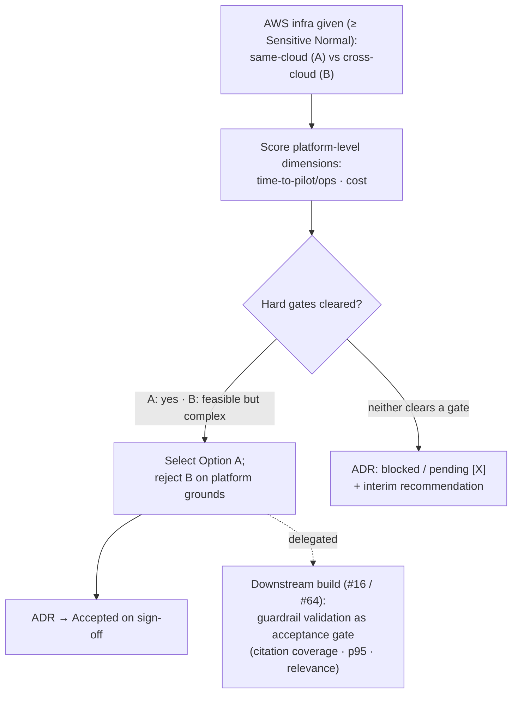

# 0002 — RAG Stack Selection for CI Knowledge Retrieval

**Author(s):** Nicholas Lim (nicholas_lim@tech.gov.sg)

**Status:** Accepted — 2026-06-30

> This ADR selects **Option A — AWS Bedrock Knowledge Bases with S3 Vectors** as the managed RAG stack for the CI pilot. The choice is made on **platform-level dimensions** (same-cloud ops, cost), since raw retrieval/answer quality tracks the *model*, not the platform (see [Context](#context)). With AWS-based infra given, every prerequisite is resolved — data-classification clearance, region/model availability, and Option B's cross-cloud feasibility. Confirming the selected stack meets the PRD guardrails is delegated to the downstream build as an acceptance gate, not held as a blocker here ([D1](#d1--decide-on-platform-level-dimensions)).

---

## Context

CI's knowledge-retrieval JTBD is built on a **managed RAG stack**: a document store, an ingestion/embedding pipeline, a vector index, and a retrieval API the CI backend calls to assemble grounded context before LLM synthesis. The pilot architecture draws these as **role-level slots** but leaves the **vendor open** — the architecture diagram ([`architecture/architecture.drawio`](../../architecture/architecture.drawio)) marks the **LLM as "vendor TBD"** and shows the Knowledge Bases subnet (Document Store, Ingestion, Vector Index) without a concrete provider. [ADR-0001](0001-ci-pilot-architecture.md) fixes the *boundaries* around the stack but not the stack itself.

This spike closes that gap by evaluating two concrete managed RAG offerings:

- **Option A — AWS Bedrock Knowledge Bases with S3 Vectors**
- **Option B — Gemini Enterprise RAG Engine (Vertex AI)**

**Given context.** CI's application infrastructure is **AWS-based within Transform GCC** (the Response Store is Amazon RDS, per ADR-0001), and the **AWS GCC account is accredited to Restricted / Sensitive Normal** — *higher* than the Official Closed (Sensitive Normal) bar this workload needs. These are fixed inputs, not under test. Consequently **Option A is same-cloud** with the rest of the system, while **Option B introduces a second cloud** (GCP/Vertex AI) reached cross-cloud from AWS-based GCC.

**Why this is a platform decision, not a retrieval bake-off.** A managed RAG stack is a pipeline — parse → chunk → embed → index → retrieve → (rerank) → synthesise with citations. The parts that drive **retrieval and answer quality** are the **embedding model** and the **synthesis LLM**, and *both are separable choices* (LLM selection is itself out of scope here, and comparable embedding models exist on either platform). A head-to-head retrieval comparison would therefore largely measure the *models* — confounded — not the *platform* choice in dispute. What genuinely differs **by platform** is operational: same-cloud vs. cross-cloud networking and accreditation, cost/egress, and the RAG mechanics baked in (parsing, citation format, latency). With AWS-based infra given, those platform-level dimensions decide the choice.

**Why this blocks build.** The chosen stack determines storage, embeddings, retrieval APIs, and SDKs for downstream build issues — #64 (ingestion pipeline), #11 (object storage), #70 (Go scaffold), #16 (context assembly). They cannot safely start until this ADR is recorded. Development starts **Jul 2026** against a **Nov 2026 pilot** launch; **time-to-pilot / ops burden** and **cost at pilot scale** are the deciding dimensions.

A few terms used throughout:

- **Managed RAG stack** — a vendor service that owns ingestion, embedding, vector storage, and retrieval behind a callable API, as opposed to a self-assembled pipeline.
- **Platform-level dimension** — a property of the managed service itself (ops, cost, networking, accreditation, RAG mechanics), as distinct from the swappable embedding/LLM model choices that drive raw retrieval/answer quality.
- **Guardrail validation** — confirming the chosen pipeline hits the PRD guardrails (**0 hallucinations, 100% citation coverage, < 5s p95**) on representative content; delegated downstream (see [D1](#d1--decide-on-platform-level-dimensions)).
- **Hard gate** — a pass/fail requirement that is not scored; a candidate that fails it is out, regardless of other strengths.
- **Transform GCC** — the Government-on-Commercial-Cloud tenancy that, per ADR-0001 and the architecture diagram, contains the entire system.

### Constraints inherited from ADR-0001

The selected stack must respect the boundaries already drawn:

- **D2 (single deployable).** The **CI backend plays the RAG orchestrator role** as one service in the App Layer subnet (context assembly → retrieval → LLM synthesis → response). The stack must be **callable from within that one service**. **Do not** select a stack that forces RAG orchestration into its own separate service for the pilot.
- **D3 (separate stores).** The CI DB (the **Response Store**, shown as Amazon RDS) persists **LLM responses only**. The vector/document store introduced by the chosen stack is **separate** from the Response Store and is not the system of record for business logic.

### Out of scope

- Building the production ingestion pipeline, vector store, or model service (#64, #70, #11, #16).
- Delivery approaches other than the two named managed stacks (e.g. self-hosted open-source RAG, or a whole-of-government platform such as Platform.gov AI).
- **A full two-stack hands-on retrieval bake-off** — de-scoped because retrieval/answer quality tracks the model, not the platform, so the comparison would be confounded and not decision-relevant given AWS-based infra (see Context).
- **Guardrail validation of the chosen pipeline** — delegated to the downstream build (#16 / #64) as an acceptance gate, since it depends on the pinned models, chunking, and a representative pipeline that this stack-exploration spike does not build (see [D1](#d1--decide-on-platform-level-dimensions)).
- **GCC data-classification clearance** — already satisfied (the AWS GCC account is accredited to Restricted / Sensitive Normal); not a scoring dimension.
- LLM synthesis model selection beyond what each stack provides natively, except where it materially affects the stack decision.

---

## Decision

### D1 — Decide on platform-level dimensions

The choice between Option A and Option B is made on **platform-level dimensions**, behind two hard gates. Raw retrieval/answer quality is *not* a platform discriminator (it tracks the model — see Context), so it is not scored here; confirming the chosen pipeline meets the guardrails is delegated downstream.

**Hard gates (pass/fail) — both resolved:**

1. **Data-classification clearance — CLEARED (both options can clear it).** The AWS GCC account is accredited to Restricted / Sensitive Normal, above the Official Closed (Sensitive Normal) bar this workload requires. For Option B, GCP can be accredited to a comparable classification **at parity with our AWS setup** — so this is *not* a feasibility gap; the difference is that Option B needs a **second, separate clearance** stood up and maintained (additional overhead, not a blocker).
2. **Provisionable for use from AWS-based GCC — RESOLVED (both options provisionable).**
   - **Option A:** S3 Vectors reached **GA in Dec 2025 and is available in `ap-southeast-1` (Singapore)**; Titan Text Embeddings V2 and Claude models are available in-region (Claude via cross-region inference — pick an inference profile that keeps routing within the accepted residency boundary). Provisionable same-cloud, no overhead.
   - **Option B:** cross-cloud access to Vertex AI from AWS-based GCC **is possible** — but adds overhead (a second cloud to connect, authenticate, network, and accredit). Feasible, so not a blocker; it counts against the time-to-pilot/ops dimension rather than clearing it cleanly.

**Platform-level scoring dimensions (decide A vs. B):**

| # | Dimension | What it measures | Why it matters |
|---|-----------|------------------|----------------|
| 1 | **Time-to-pilot / ops burden** | Provisioning, networking, IAM, accreditation, and run-cost to reach and operate the pilot | Fixed **Nov 2026** launch; small team; dominated by same-cloud vs. cross-cloud |
| 2 | **Cost at pilot scale** | Storage + embedding + retrieval + inference cost (incl. any cross-cloud egress) at pilot volume | Pilot budget; sets the unit economics the platform inherits |

**Guardrail validation is delegated downstream.** Confirming the chosen pipeline clears the PRD guardrails (relevance, 100% citation coverage / 0 hallucinations, < 5s p95) depends on the pinned embedding model, synthesis LLM, and chunking — all build-time decisions. It is therefore carried into #16 / #64 as an **acceptance gate**, not a precondition for this stack decision. (If that validation later fails, it is a configuration/model problem to remedy in build, not a reason to re-pick the platform.)

### D2 — Evaluation of the two candidates

#### Option A — AWS Bedrock Knowledge Bases + S3 Vectors

- **What it is.** A fully managed RAG service: Bedrock Knowledge Bases auto-fetches from S3, parses and chunks, generates embeddings, and stores them in an **S3 Vectors** index. Retrieval is via the **`Retrieve`** and **`RetrieveAndGenerate`** APIs; the latter returns generated answers **with citations**, which maps directly onto the citation-coverage guardrail.
- **Architecture fit (D2/D3).** Callable from a single backend via the AWS SDK — no separate orchestration service required, satisfying **D2**. The S3 Vectors index is a **distinct store** from the RDS Response Store, satisfying **D3**. Models (incl. Claude) are reachable through Bedrock in `ap-southeast-1`.
- **Time-to-pilot / ops.** **Strong — same cloud** as the Response Store (RDS) and within the already-accredited AWS GCC account: one IAM model, no cross-cloud networking or egress, one accreditation boundary, deploys naturally inside the App Layer subnet. S3 Vectors is GA in-region (Singapore).
- **Cost at pilot scale.** Dominated by LLM inference (roughly stack-independent). The RAG layer itself is near-negligible: S3 Vectors query processing is ~**$0.002/TB scanned** plus low $/GB storage (single-digit dollars/month at pilot vector counts), and Titan Text Embeddings V2 is **$0.02 / 1M tokens** (a few dollars to embed a pilot corpus). **No cross-cloud egress.**
- **Watch-outs.** S3 Vectors is a comparatively **new** GA service; latency/recall maturity at our corpus shape is confirmed by the downstream guardrail gate, not assumed. Claude in Singapore is served via cross-region inference — pin an inference profile consistent with the residency boundary.

#### Option B — Gemini Enterprise RAG Engine (Vertex AI)

- **What it is.** A fully managed RAG service on Vertex AI built around **RAG corpora**, with managed ingestion/embedding and **agentic cross-corpus retrieval**. Retrieval is via **`AsyncRetrieveContexts`** (async, multi-corpus) and **`AskContexts`** (synchronous answer generation); grounding contexts are returned for citation.
- **Architecture fit (D2/D3).** Callable from a single backend via the Vertex AI SDK — satisfies **D2** in principle. RAG corpora are a **distinct store** from RDS — satisfies **D3**. Native synthesis is via Gemini models.
- **Time-to-pilot / ops.** **Weaker — introduces a second cloud, though every step is feasible.** Cross-cloud access from AWS-based GCC is **possible**, and GCP data-classification clearance is **achievable at parity with our AWS setup**. The cost is purely *additional overhead*: a GCP project to provision, cross-cloud authentication and networking to stand up, and a second clearance to obtain and maintain — more provisioning and operational surface against a fixed launch date and a small team. Nothing here blocks Option B; it simply adds work that Option A does not.
- **Cost at pilot scale.** Comparable token-priced inference (Gemini) and low storage/embedding cost in absolute terms — **at rough parity with Option A on the model/RAG layer**. The one marginal difference is **cross-cloud egress**, which applies because the rest of the system sits in AWS-based GCC — a cost Option A does not incur.
- **Architecture fit / retrieval.** Meets D2 (single deployable via Vertex SDK) and D3 (separate store) like Option A. Agentic cross-corpus retrieval is a capable retrieval mechanism; no retrieval-quality disadvantage is implied, since quality tracks the model, not the platform.
- **Net standing vs. A.** Roughly **at parity on capability, retrieval quality, and absolute cost**, and **clears both hard gates** — but **strictly behind on time-to-pilot/ops** because of the second-cloud overhead and the marginal egress cost. There is no dimension on which Option B is *ahead* of Option A given AWS-based infra.

### D3 — Recommendation

**Select Option A — AWS Bedrock Knowledge Bases with S3 Vectors.** Reject Option B on platform grounds.

The decision rests on the platform-level dimensions, which are decisive given AWS-based infra and now have no open prerequisites:

- **Time-to-pilot / ops (decisive).** Option A keeps the *entire* CI system in **one cloud and one already-accredited boundary**, deploying inside the existing App Layer subnet. Option B is fully feasible — GCP clears to a comparable classification at parity, and cross-cloud provisioning is possible — but it adds a second cloud, cross-cloud networking, and a second clearance to stand up and maintain: real overhead against the **Nov 2026** date and a small team.
- **Cost.** At rough parity on the model/RAG layer; Option A's only edge is incurring **no cross-cloud egress**, a marginal saving over B.
- **Quality is not a tiebreaker** — it tracks the embedding model and synthesis LLM, which are separable choices, so it favours neither platform.

**Why Option B was rejected, recorded:** *not* on feasibility, capability, retrieval quality, clearance, or absolute cost — Option B is at rough parity on all of these and clears both hard gates. It is rejected solely because, with AWS-based infra given, it carries **additional overhead** (a second cloud to provision/network, a second data-classification clearance to maintain, and marginal cross-cloud egress) **for no offsetting advantage over Option A**. A close call on a different infra footprint; a clear one here.

**Accepted.** No open blockers. Confirming the built pipeline meets the guardrails is an acceptance gate carried into the downstream build (#16 / #64).

---

## Decision summary

Legend: ✅ advantage · 🟰 parity · ⚠️ feasible, but added overhead.

| Factor | Option A — Bedrock + S3 Vectors | Option B — Gemini Enterprise RAG Engine |
|--------|---------------------------------|------------------------------------------|
| **Time-to-pilot / ops** (decisive) | ✅ same cloud as RDS, single IAM, one accreditation | ⚠️ feasible, but second cloud to provision + network and a second clearance to maintain |
| **Cost at pilot scale** | ✅ near-negligible RAG layer, no egress | 🟰 model/RAG layer at parity; ⚠️ adds marginal cross-cloud egress |
| **Hard gate: data classification** | ✅ cleared (AWS GCC ≥ Sensitive Normal) | 🟰 clearable at parity (GCP clears like our AWS setup) — but a second clearance to stand up |
| **Hard gate: provisionable from AWS GCC** | ✅ S3 Vectors GA in `ap-southeast-1`; models in-region | ⚠️ possible cross-cloud, with added networking/IAM overhead |
| **Architecture fit (D2 single deployable)** | 🟰 AWS SDK from one service | 🟰 Vertex SDK from one service |
| **Capability / retrieval quality** | 🟰 model-driven, not a platform discriminator | 🟰 model-driven, not a platform discriminator |
| **Outcome** | **Selected** | **Rejected — no advantage over A, only added overhead** |

*Both options clear the hard gates and are at rough parity on capability, retrieval quality, and absolute cost. Option A wins solely on time-to-pilot/ops (same-cloud) plus a marginal no-egress cost edge. Guardrail compliance (100% citation coverage, < 5s p95, relevance) is validated downstream as a build acceptance gate (#16 / #64), not in this ADR.*

---

## Evaluation flow

---

## Consequences

### Positive

- **A clean, fast decision.** With quality removed as a (confounded) platform discriminator and every prerequisite resolved, the stack is chosen on the dimensions that actually differ — and build issues (#64/#70/#11/#16) can start against a committed stack.
- **Single cloud, single accreditation.** Staying in the already-accredited AWS GCC account avoids a second cloud's networking, IAM, egress, and clearance overhead entirely.
- **Cost transparency.** The RAG layer is near-negligible at pilot scale; total cost is dominated by LLM inference, which is roughly stack-independent — so the decision carries no hidden storage-cost surprise.
- **End-state-compatible boundaries.** Option A slots into the CI backend / RAG orchestrator role (D2) as a single deployable and keeps the vector/document store separate from the Response Store (D3); the choice does not disturb ADR-0001's boundaries.

### Negative / risks

- **Deviation from the original AC.** Issue #71 originally asked for hands-on comparison evidence across both stacks. This ADR de-scopes that and delegates guardrail validation to the downstream build (issue #71 was updated 2026-06-30 to match: AC2 now delegates validation to #16/#64 as an acceptance gate). *Risk:* a reviewer expects a retrieval comparison. *Mitigation:* the rationale (model-vs-platform confounding + AWS-given + cleared gates) is recorded here and in the issue.
- **Guardrail compliance is unverified at decision time.** The pipeline's citation coverage / latency / relevance are confirmed only downstream. *Risk:* a late guardrail miss. *Mitigation:* it is an explicit acceptance gate in #16 / #64; and a miss is a model/chunking fix, not a platform re-pick, since quality is model-driven.
- **New-offering risk on S3 Vectors.** As a recently-GA service, operational maturity at our corpus shape is still to be proven. *Mitigation:* the downstream gate makes latency (< 5s p95) and recall explicit pass criteria; keep the CI backend's retrieval call behind a thin internal interface so the vector store is swappable if needed.
- **Cross-region inference residency.** Claude in Singapore is served via cross-region inference. *Mitigation:* pin an inference profile (in-region / APAC) consistent with the data-residency boundary before build.

### Follow-ups

1. **Update the architecture diagram** to close the "vendor TBD" LLM slot and fill the Knowledge Bases roles (Document Store, Ingestion, Vector Index) with the Bedrock + S3 Vectors stack now that this ADR is Accepted.
2. **Carry guardrail validation into the downstream build** (#16 / #64) as an acceptance gate: ingest an Official-Closed/non-sensitive SDT + wellbeing corpus, run a representative query set with gold references, and record per-query relevance, citation fidelity, and warm p95 against the guardrails.
3. **Pin the embedding model and synthesis LLM** (and a residency-safe inference profile) during build, and produce a quantified pilot-scale cost estimate once query volume is known.
4. Commit the supporting **evidence summary** under `docs/adr/`; do not commit throwaway prototype scripts, the sample corpus, or vendor credentials.

---

## References

- [ADR-0001 — CI Pilot Architecture](0001-ci-pilot-architecture.md) — boundaries the chosen stack must respect (D2 single deployable, D3 separate stores)
- [Application architecture diagram](../../architecture/architecture.drawio) (`architecture/architecture.drawio[.png]`) — "vendor TBD" LLM slot and Knowledge Bases roles this ADR closes
- [Product requirements (PRD)](../../prd/TW%20Contextual%20Intelligence%20v1.0%20%E2%80%94%20Capability%20Layer%20%2B%20Knowledge%20Retrieval%20JTBD.md) — business context and guardrails (0 hallucinations, 100% citation coverage, < 5s p95, data-classification enforcement); Part 1.1 Knowledge Base + RAG + Model Service
- Issue [#71](https://github.com/String-sg/tw-context-intelligence/issues/71) — Tech Stack Exploration for CI (scope updated 2026-06-30 to de-scope hands-on retrieval and delegate guardrail validation to the downstream build); Epic [#1](https://github.com/String-sg/tw-context-intelligence/issues/1) — TW RAG + Model Service
- [Amazon Bedrock Knowledge Bases](https://aws.amazon.com/bedrock/knowledge-bases/) · [Using S3 Vectors with Bedrock Knowledge Bases](https://docs.aws.amazon.com/AmazonS3/latest/userguide/s3-vectors-bedrock-kb.html) · [S3 Vectors GA + regions (incl. Singapore)](https://aws.amazon.com/about-aws/whats-new/2025/12/amazon-s3-vectors-generally-available/) · [Bedrock pricing](https://aws.amazon.com/bedrock/pricing/) · [Claude global cross-region inference in Singapore](https://aws.amazon.com/blogs/machine-learning/global-cross-region-inference-for-latest-anthropic-claude-opus-sonnet-and-haiku-models-on-amazon-bedrock-in-thailand-malaysia-singapore-indonesia-and-taiwan/)
- [Vertex AI RAG Engine overview](https://docs.cloud.google.com/gemini-enterprise-agent-platform/build/rag-engine/rag-overview) · [Introducing Vertex AI RAG Engine](https://cloud.google.com/blog/products/ai-machine-learning/introducing-vertex-ai-rag-engine) · [RAG Engine cross-corpus retrieval](https://docs.cloud.google.com/gemini-enterprise-agent-platform/build/rag-engine/cross-corpus-retrieval)
