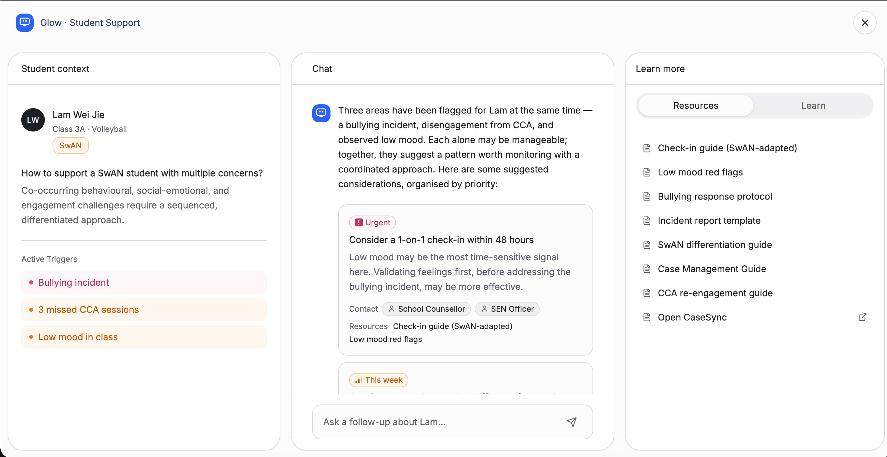
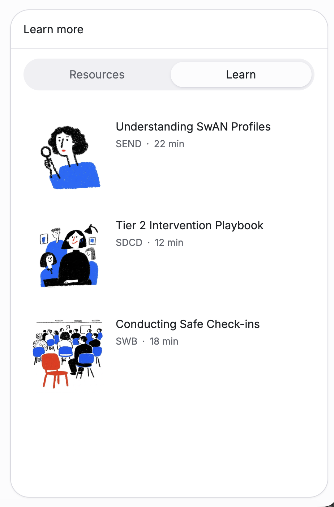
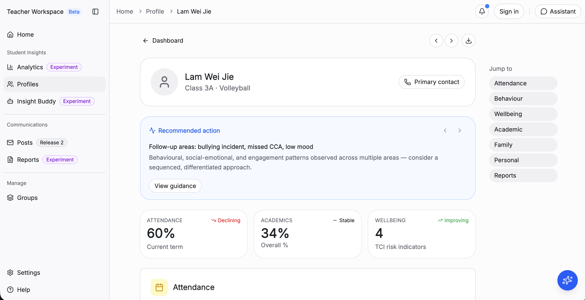

# TW Contextual Intelligence v1.0: Capability Layer + Knowledge Retrieval JTBD

**Status:** Draft v3.6 | **Last updated:** 2026-06-22 | **Authors:** Jasmine Tay, PM; Ralph Santos, Engineer

---

## Table of Contents

- [What is CI](#what-is-ci)
- [Background](#background)
  - [Problem Statement](#problem-statement)
  - [Evidence of Problem](#evidence-of-problem)
  - [Hypothesis of Root Causes](#hypothesis-of-root-causes)
- [Why Now](#why-now)
- [Success](#success)
  - [North Star Metric](#north-star-metric)
  - [Product Metrics](#product-metrics)
  - [Guardrail Metrics](#guardrail-metrics)
- [In Scope](#in-scope)
  - [SDT Pilot within TW](#sdt-pilot-within-tw)
  - [Addressable Market](#addressable-market)
  - [Data Classification Constraints](#data-classification-constraints)
  - [Out of Scope](#out-of-scope-this-phase)
- [Epic Structure](#epic-structure)
- [Product Requirements](#product-requirements)
  - [E1: TW RAG + Model Service](#e1-tw-rag--model-service)
    - [Part 1.1: Knowledge Base + RAG + Model Service](#part-11-knowledge-base--rag--model-service)
  - [E2: MicroFE for CI](#e2-microfe-for-ci)
    - [MicroFE Integration Approach](#microfe-integration-approach)
    - [Part 2.1: AI Chat Interface](#part-21-ai-chat-interface)
    - [Part 2.2: Recommendation Cards](#part-22-recommendation-card-surfacing-in-tw-student-page)
    - [Part 2.3: Native Resource Viewer](#part-23-knowledge-storage--retrieval--native-resource-viewer-in-tw)
  - [E3: Data integrations](#e3-data-integrations)
    - [Part 3.1: Data Connection Layer](#part-31-data-connection-layer)
    - [Part 3.2: Context Assembly Layer](#part-32-context-assembly-layer)
    - [Part 3.3: Analytics & Tracking](#part-33-analytics--tracking)
  - [E4: Testing + Polishing + TRA](#e4-testing--polishing--tra)
    - [Part 4.1: AI Evaluations](#part-41-ai-evaluations)
    - [Part 4.2: TRA](#part-42-tra)

---

Changelog

| Version | Date | Author | Summary |
|---------|------|--------|---------|
| v3.6 | 2026-06-22 | Jasmine Tay | E2: add MicroFE integration approach options (standalone app vs remote MicroFE vs component library) + prototype screenshots; E1: rephrase infrastructure stories 1.7, 1.8, 1.9, 2.7 as system-actor stories |
| v3.5 | 2026-06-22 | Jasmine Tay | Align PRD to GitHub issues: GCS (not S3), 5 signals (not 6), AI evals → MOE AI Evals platform (pre-deployment) + Langfuse (post-deployment) |
| v3.4 | 2026-06-22 | Jasmine Tay | Merge v3.2 (Ralph) + v3.3 (Jasmine); epic structure and timeline aligned to 4-epic structure |
| v3.3 | 2026-05-13 | Jasmine Tay | Add CI Overview section: CI as platform capability layer with multiple JTBDs; knowledge retrieval = first JTBD; align timeline to strategy doc (Jul 2026 dev start, Nov 2026 pilot) |
| v3.2 | 2026-06-10 | Ralph Santos | Restructure delivery into 4 epics: E1 TW RAG + Model Service, E2 MicroFE for CI, E3 Data integrations, E4 Testing + Polishing + TRA; defer knowledge base management portal (story 6.5) to post-pilot |
| v3.1 | 2026-05-07 | Jasmine Tay | Reframe addressable market: Phase 1 pilot is TW GA (all 33,000 teachers) scoped to 5 student signals; Phases 2–3 now reflect feature/domain expansion rather than audience rollout |
| v3.0 | 2026-05-07 | Jasmine Tay | Tech stack finalised: `@google-cloud/aiplatform` (Vertex RAG Engine) + `@google/genai` (Gemini); resolve storage to GCS; update Part 7 AI Evaluations from Langfuse to Vertex AI Evaluation Service + Cloud Logging |
| v2.10 | 2026-04-29 | Ralph Santos | Part 1 — add unified SDK evaluation: Vercel AI SDK not adopted (RAG Engine unsupported, no portability or UI-hook benefit); selected first-party `@google-cloud/aiplatform` (Vertex RAG Engine) + `@google/genai` (Gemini synthesis) with pros/cons documented |
| v2.9 | 2026-04-14 | Jasmine Tay | Add Part 7: AI Evaluations — Langfuse instrumentation + evals platform integration (2 stories: 7.1–7.2); remove 7.3 (eval config handled by AI team) |
| v2.8 | 2026-04-14 | Jasmine Tay | Remove story 6.1 (data governance + retention) — handled on cloud infrastructure side; update open questions and risks accordingly |
| v2.7 | 2026-04-14 | Jasmine Tay | Refine Part 6 — rename conversation log viewer to conversation analytics (logs, usefulness ratings, query trends, citation engagement); remove log filters |
| v2.6 | 2026-04-14 | Jasmine Tay | Add Part 6 Management Portal (pilot scope); migrate knowledge base storage from GDrive to cloud storage (GCS or S3 — TBD); update Business Stakeholders to Knowledge Base Steering Committee |
| v2.5 | 2026-03-31 | Jasmine Tay | Condense Technical Stack Selection to single story 1.12 covering options eval, GCC validation, and spike |
| v2.4 | 2026-03-31 | Jasmine Tay | Add user stories 1.12–1.14 for Technical Stack Selection (GCC validation, Vertex AI spike, Platform.gov AI assessment) |
| v2.3 | 2026-03-31 | Jasmine Tay | Add Technical Options Evaluation to Part 1 (open-source vs cloud AI services in GCC vs Platform.gov AI) |
| v2.2 | 2026-03-31 | Jasmine Tay | Move TW API contract stories to Part 2; add PM + Engineer stories across Parts 2–5 |
| v2.1 | 2026-03-31 | Jasmine Tay | Remove 1.2 EduPass alignment story — existing MIMS roles doc sufficient; reindex |
| v2.0 | 2026-03-31 | Jasmine Tay | Updated Part 1 user stories to cover all three layers (Contextual Data, Knowledge Base, AI Model) with PM + Engineer stories |
| v1.9 | 2026-03-31 | Jasmine Tay | Streamlined Part 1 Technical Considerations to open questions only |
| v1.8 | 2026-03-31 | Jasmine Tay | Restructured Part 1 Key Capabilities into Contextual Data / Knowledge Base / AI Model sub-sections |
| v1.7 | 2026-03-31 | Jasmine Tay | Reordered Product Requirements sections to match part numbering; renamed Part 1 |
| v1.6 | 2026-03-31 | Jasmine Tay | Added table of contents |
| v1.5 | 2026-03-31 | Jasmine Tay | Renumbered parts to reflect delivery priority order |
| v1.4 | 2026-03-31 | Jasmine Tay | Added other commitments notes to Core Product Team |
| v1.3 | 2026-03-31 | Jasmine Tay | Removed Stakeholders section (consolidated into Team Roles) |
| v1.2 | 2026-03-31 | Jasmine Tay | Added team capacity to Core Product Team table |
| v1.1 | 2026-03-31 | Jasmine Tay | Added Team Roles section |
| v1.0 | 2026-03-25 | Jasmine Tay | Updated tech stack to Google Cloud (Vertex AI + Google Drive); added GDrive TRA as compliance prerequisite; flagged Drive viewer as open question for Part 4 |
| v0.7 | 2026-03-18 | Jasmine Tay | Added changelog + Analytics & Tracking section |
| v0.6 | 2026-03-18 | Jasmine Tay | Added SDT data classification constraints and guardrail metric |
| v0.5 | 2026-03-18 | Jasmine Tay | Manual edits — updated Part 1 user stories, reordered priority table |
| v0.4 | 2026-03-18 | Jasmine Tay | Renamed "Backend engineer" → "Engineer" across all user stories |
| v0.3 | 2026-03-18 | Jasmine Tay | Updated Part 1 user stories: AIBots UAT, SDT + HR/EduPass data pull |
| v0.2 | 2026-03-18 | Jasmine Tay | Added OPAL evidence, addressable market, priority & timeline, native resource viewer (Part 4) |
| v0.1 | 2026-03-17 | Jasmine Tay | Initial draft |

---

## What is CI

CI is a **platform capability layer within Teacher's Workspace** — not a single feature, but a foundation for surfacing AI-assisted support at the moments teachers need it most. It is designed to serve multiple teacher jobs-to-be-done over time:

| JTBD | Description | Status |
|------|-------------|--------|
| **Knowledge retrieval** | Surface the right guidance at the moment of need — in the flow of work, grounded in official MOE materials | **In scope — this PRD** |
| Insights summary | Synthesise student or cohort patterns into an actionable brief | Planned |
| Drafting assistance | Generate first drafts of communications, case notes, or reports | Planned |

CI represents the **contextual (push)** learning trigger — learning woven into the natural workflow of teachers, surfaced at the point of need rather than sought out. This is distinct from compliance-driven learning (Glow) and self-directed learning, and is the highest-potential trigger for meaningful professional development.

**This PRD covers knowledge retrieval only.** Subsequent JTBDs will be scoped separately as CI matures.

---

## Background

### Problem Statement

Teachers face high cognitive load daily. MOE has extensive domain-scoped learning and guidance materials to support them — but these materials fail teachers at the moment of need:

1. **Invisible at point of need** — Materials require active recall; teachers must already know a resource exists and where to find it
2. **Scattered across platforms** — Content lives across MOE Intranet, SharePoint, and other sites with poor search and browse experiences, leading to time sunk in information retrieval
3. **Text-heavy and hard to parse** — Guidance documents are lengthy and dense, making it difficult to extract key actionable points quickly (e.g., teachers spend significant time sifting through a 20-page student bullying intervention guide)

### Evidence of Problem

- 58.7% of users cannot find what they need on OPAL (n=90) [link](http://go.gov.sg/2026-0203-km)
- Search trends on OPAL across all keywords have dropped sharply since launch [link](https://gvt-external.slack.com/archives/C08CAM58T9U/p1740982877978059?thread_ts=1740712798.642099&cid=C08CAM58T9U)
- Teachers filter for relevance when engaging in PL [link](https://drive.google.com/drive/u/0/folders/1QxQsVP1sqjYvxLIPRSCSZLTJ1xDkLk27)
- Teachers want a path of least resistance to discovery [link](https://drive.google.com/drive/u/0/folders/1QxQsVP1sqjYvxLIPRSCSZLTJ1xDkLk27)

### Hypothesis of Root Causes

1. **No contextual delivery mechanism** — There is no system that proactively surfaces relevant guidance based on what a teacher is currently doing (e.g., handling a student wellbeing case)
2. **No intelligent synthesis layer** — Materials are served as-is; there is no AI layer that can extract key points, summarise guidance, and present it in a digestible format
3. **Fragmented information architecture** — Content is distributed across multiple platforms with no unified retrieval layer

---

## Why Now

- **TW ready in April 2026** — Teacher's Workspace is launching as the primary working tool for teachers, providing the ideal integration surface to contextually surface guidance
- **Available content from SDT** — Student development and wellbeing domains have structured materials ready to be ingested as the knowledge base
- **AI appetite on the ground is growing** — Teachers and school leaders are increasingly receptive to AI-assisted workflows; this is the right window to establish a trustworthy first experience
- **Google Cloud selected as AI infrastructure** — Vertex AI provides a scalable, sustainable foundation for RAG and knowledge management that can be extended across MOE products beyond CI

---

## Success

### North Star Metric

**Time saved in synthesis cost** — Reduction in time teachers spend locating materials + extracting information from materials. Measured via workstream mapping survey comparing pre- and post-intervention workflows.

### Product Metrics

| Metric | Definition | Target |
|--------|-----------|--------|
| CI card engagement | % of surfaced recommendation cards that teachers interact with (click/expand) | > 40% |
| CI recommendations CTR | Click-through rate on recommendations within cards | > 20% |
| Usefulness rating | # of teachers who report the recommendation as useful (thumbs up / feedback) | Track and grow |
| AI chat sessions per teacher | Frequency of teachers engaging with the chat interface after card interaction | TBD after pilot baseline |

### Guardrail Metrics

| Metric | Definition | Threshold |
|--------|-----------|-----------|
| Hallucination incidents | AI-generated content that is fabricated or not grounded in source materials | 0 |
| Source citation coverage | % of AI responses that include citations back to source documents | 100% |
| Response latency | Time for recommendation card or chat response to render | < 5s (p95) |
| Data classification breach | Sensitive High student data surfaced to a teacher without Sensitive High access | 0 |

---

## In Scope

### SDT Pilot within TW

- **Pilot domains:** Tier 2/3 Student Intervention and Student Wellbeing
- **Pilot audience:** All teachers on Teacher's Workspace — CI ships GA from TW launch; pilot scope is limited to 5 student context signals (see Data Classification Constraints)
- **Domain owners:** Knowledge Base Steering Committee (GB, CCE, and other profwing branches — see Team Roles)
- **Addressable market:** All 33,000 General Education Officers (EOs) in MOE

### Addressable Market

| Phase | CI scope | Audience | Reach |
|-------|---------|----------|-------|
| Phase 1 (Pilot — Aug 2026) | Chat interface, 5 student signals, SDT domains | All TW users | Up to 33,000 |
| Phase 2 (Expansion — post-pilot) | Expanded student signals, additional knowledge base domains | All TW users | Up to 33,000 |

### Data Classification Constraints

> **Note:** For the pilot, CI surfaces guidance based on 5 fixed student signals. Before surfacing CI, the system must verify that the accessing teacher's role has permission to view each signal. If a teacher does not have access to a signal, CI must not be surfaced for that context.

**Scope 1: Holistic Development Growth Conversations** *(GB data)*

| Signal | Trigger | Status |
|--------|---------|--------|
| SE Skills Intent 1, 2 or 3 | Average MySEI Intent Score < 2 | TBC — pending additional technical evaluation |
| Social Links | Social Links < 2 | TBC |
| TCI Low Mood | Low Mood > 2 terms | TBC |

**Scope 2: SwAN Support** *(SDT data)*

| Signal | Trigger | Status |
|--------|---------|--------|
| Long-term Absenteeism (LTA) | Late-coming count > n | TBC |
| Has an offence | Type of offence = [TBD] | TBC |
| SEN | SEN type = [TBD] | TBC |

> **Knowledge base storage classification:** Guidance materials stored for RAG ingestion must be classified at **Official Closed (Sensitive Normal)** or above. Google Cloud Storage (GCS) must be confirmed as cleared to this level in the GCC environment before document ingestion begins. See Part 1.1 open questions.

### Out of Scope (this phase)

- Domains beyond Student Intervention and Student Wellbeing
- Automated actions (AI recommends, teacher decides)
- Content creation or editing of source materials
- No generative AI output
- **Knowledge base management portal** — domain owner UI for uploading, tagging, and deleting materials (story 6.5) is deferred to post-pilot; initial ingestion handled directly by the engineering team

---

## Epic Structure

CI is delivered across 4 epics. Each epic maps to one or more product parts below.

| Epic | Parts | Features |
|------|-------|---------|
| **E1: TW RAG + Model Service** | Part 1.1 | Reusable TW platform capability for RAG + LLM. **Knowledge base** — GCS bucket, Vertex AI embeddings + Vector Search, chunking + document refresh pipeline. **AI model + model service API** — RAG orchestration via Vertex AI; Gemini synthesis with strict source grounding; model service API endpoint for TW apps. Context assembly lives in E3. |
| **E2: MicroFE for CI** | Parts 2.1, 2.2, 2.3 | CI frontend as a micro-frontend pluggable into any TW app. **Recommendation cards** — surfaced on SDT student profile, triggered by student signals. **AI Chat interface** — pre-loaded context, follow-up Q&A, inline citations. **Native resource viewer** — inline document viewer deep-linked from citations. UX design for all components. |
| **E3: Data integrations** | Parts 3.1, 3.2, 3.3 | **Data connection layer** — SDT connector for student signals (absenteeism, SEN, offence data); teacher role connector (SDT or EduPass TBD); data classification enforcement at connection point. **Context assembly layer** — combines student signals, teacher role, and situational context (which TW page/student) into a structured retrieval query for E1. **Analytics & tracking** — dedicated GA4 property; custom events for cards/chat/citations; server-side guardrail logging. |
| **E4: Testing + Polishing + TRA** | Parts 4.1, 4.2 | **AI evaluations** — pre-deployment quality gates via Kaleidoscope (hallucination, citation coverage, response relevance); post-deployment production monitoring via Langfuse. LLM guardrails testing, end-to-end QA, UX polish. **TRA** — technical risk assessment sign-off required before pilot launch. |

> **Knowledge base management portal** (domain owner upload/tag/delete UI, story 6.5) is deferred to post-pilot. Initial knowledge base population is handled directly by the engineering team. See [Out of Scope](#out-of-scope-this-phase).

---

## Product Requirements

---

### E1: TW RAG + Model Service

#### Part 1.1: Knowledge Base + RAG + Model Service

**What it is:** A reusable TW platform capability for RAG + LLM — any TW app can call the model service API to get grounded, cited AI responses. CI is the first consumer. Covers: (1) a knowledge base of MOE guidance materials indexed for semantic retrieval, (2) a RAG + LLM layer that synthesises grounded guidance, and (3) a model service API that TW apps call to retrieve AI responses. Student and teacher data integrations live in E3.

**Key capabilities:**

**Knowledge Base** — guidance content that the AI retrieves from; managed by domain owners

- Guidance materials from Student Intervention and Student Wellbeing domains, stored in a **Google Cloud Storage (GCS) bucket** and managed via the Management Portal (deferred to post-pilot — see Out of Scope)
- Chunking and embedding pipeline to convert documents into a searchable vector store, using **Vertex AI** (embeddings + Vector Search)
- Document refresh cadence: re-ingestion process triggered when domain owners upload or update materials via the portal
- **Metadata tagging schema** — every content piece carries mandatory tags to enable use-case-scoped retrieval:

| Tag | Description | Example values |
|-----|-------------|---------------|
| `category` | Which CI capability this content serves | `knowledge_retrieval` \| `insights_summary` \| `drafting` |
| `use_case` | Which CI use case(s) this content addresses (supports multi-tag for cross-use-case content) | `swan_intervention` \| `growth_conversations` \| `exam_facilitation` |

Signal-to-use-case mapping (e.g. `active_sen_type` → `swan_intervention`) is handled by the context assembly layer, not encoded in KB tags — see [Part 3.2: Context Assembly Layer](#part-32-context-assembly-layer).

Content owners tag their own material. Schema is shared and enforced centrally.

**AI Model + Model Service API** — retrieval, synthesis, and serving layer

- **RAG orchestration** via Vertex AI — retrieves relevant document chunks based on the assembled context query (context assembly lives in E3)
- **LLM synthesis** via Gemini — synthesises retrieved chunks into digestible guidance
- **Strict grounding** — all outputs must cite source documents; no unsupported claims
- **Model service API** — endpoint serving grounded, cited AI responses to TW apps; API contract agreed with TW team

**Technical options evaluation:**

Three approaches were evaluated for the AI stack:

| Option | Approach | Verdict |
|--------|----------|---------|
| **A — Self-host open-source AI** | Deploy and manage open-source LLMs (e.g. Llama 3, Mistral) on own infrastructure; build RAG pipeline from scratch | ❌ Not recommended |
| **B — Cloud AI services in GCC** | Managed RAG + LLM via Google Cloud (Vertex AI + Gemini) or AWS Bedrock, within GCC environment | ✅ Recommended |
| **C — Platform.gov AI** | Leverage Singapore Government's whole-of-government AI platform (e.g. Pair, Launchpad AI) for LLM synthesis | ⚠️ Partial fit — revisit |

**Option A — Self-host open-source AI**
- *Pros:* Full control; no vendor lock-in; lower marginal cost at scale
- *Cons:* Heavy engineering burden (infra, security hardening, model ops); dedicated AI infra team needed; GCC compliance not pre-cleared; RAG tooling must be built from scratch
- *Verdict:* Engineering overhead exceeds current team capacity (0.2 TL, 0.5 + 0.5 Engineers) and Aug 2026 pilot timeline

**Option B — Cloud AI services in GCC (Vertex AI / AWS Bedrock)**
- *Pros:* Managed and production-ready; Google Cloud already approved for MOE; integrated RAG orchestration + Vector Search + LLM in one stack; data residency and enterprise security built-in; fastest time-to-pilot
- *Cons:* Vendor dependency; ongoing cloud costs; requires GCC-specific Vertex AI provisioning
- *Verdict:* Best balance of capability, compliance, and delivery speed — **selected approach**

**Option C — Platform.gov AI (e.g. Pair, Launchpad AI)**
- *Pros:* Pre-cleared for government data classification; centrally managed; simplified procurement; aligns with WOG AI strategy
- *Cons:* Limited support for custom RAG pipelines and knowledge base ingestion; dependency on platform roadmap; less control over retrieval quality and grounding
- *Verdict:* Insufficient for full RAG orchestration at current platform maturity. Monitor roadmap — if a RAG-compatible managed offering becomes available, evaluate for the LLM synthesis layer to reduce costs and improve WOG alignment

**Decision:** Proceed with **Option B (Vertex AI in GCC)**. Continue to track Platform.gov AI capabilities for potential adoption in a future phase.

**SDK evaluation:**

Two questions decided here: (1) whether to use a third-party LLM abstraction layer (e.g. Vercel AI SDK), and (2) which first-party SDK(s) to use against the Vertex RAG Engine + Gemini stack.

*1. Abstraction layer — Vercel AI SDK*

- *Pros:* Slim, modern API; normalised streaming protocol with `useChat` / `useCompletion` UI hooks; built-in helpers for tool calls and Zod-schema structured outputs; easy provider switching across supported vendors
- *Cons:* Adds a third-party dependency between us and Vertex AI; **does not support Vertex RAG Engine** (no corpus management, no `retrieveContexts` / `augmentPrompt`) — we would still need `@google-cloud/aiplatform` alongside it; trails first-party SDKs on new Gemini features
- *Verdict:* ❌ **Not adopted.** Vertex RAG Engine is the selected stack with no near-term plan to switch providers, and TW renders the chat UI itself (so Vercel's UI hooks add no value). Adopting it would mean carrying *both* Vercel AI SDK and `@google-cloud/aiplatform` while realising none of the portability or UI benefits. Revisit only if a future phase requires multi-provider support.

*2. First-party SDKs — selected*

Google's official Node SDKs, called directly. Two packages cover the stack:

| Package | Role | Notes |
|---------|------|-------|
| `@google-cloud/aiplatform` | Vertex RAG Engine — corpus management, file import, context retrieval, prompt augmentation | Uses `VertexRagDataServiceClient` and `VertexRagServiceClient`. The only Node SDK that exposes RAG Engine APIs |
| `@google/genai` | Gemini synthesis — content generation, streaming, function calling | Google's current unified Gemini SDK; supersedes the older `@google-cloud/vertexai` and `@google/generative-ai` packages for new Gemini features |

> `@google-cloud/aiplatform` could technically cover Gemini synthesis as well (via `PredictionServiceClient`), but its GAPIC-style API is verbose. `@google/genai` is added for its slimmer, more modern interface on the synthesis path. To revisit if the second SDK starts to feel like overhead.

*Top trade-offs of going first-party* (vs an abstraction layer):

| Pros | Cons |
|------|------|
| Full Vertex RAG Engine support — the only Node SDK that exposes it | No provider portability — Vertex AI only; swapping providers later is a rewrite, not a config change |
| Day-one access to new Vertex / Gemini features (no third-party adaptation lag) | `@google-cloud/aiplatform` uses verbose GAPIC-style APIs; more boilerplate than slim wrappers |
| Native Google Cloud auth (Application Default Credentials, service accounts, workload identity) — no extra auth layer to configure | No built-in UI/streaming helpers; we forward Gemini streams to TW over our own SSE layer (minor — TW owns the chat UI anyway) |

---

**Open questions:**

1. ✅ **Vertex AI data residency** — resolved: hosting in GCC satisfies MOE IT data residency requirements
2. **Document refresh cadence** — define how often guidance materials are re-ingested from cloud storage; whether ingestion is triggered automatically on upload or run on a schedule
3. **GCS clearance** — confirm GCS bucket is cleared to Official Closed (Sensitive Normal) in the GCC environment
4. **Retrieval quality** — define testing approach to ensure relevant chunks are retrieved for given student/teacher contexts

**User stories:**

| # | As a... | I want to... | So that... |
|---|---------|-------------|-----------|
| **Knowledge Base** | | | |
| 1.7 | System | ingest guidance documents from the GCS bucket | any document added to GCS is chunked, embedded, and retrievable via semantic search |
| 1.8 | System | chunk and embed each ingested document via Vertex AI | every chunk is indexed in Vector Search with a reference back to its source document |
| 1.9 | System | detect and re-ingest updated documents from GCS on a defined refresh schedule | within the refresh window, the knowledge base reflects the latest content and stale chunks are removed |
| **AI Model + Model Service API** | | | |
| 2.7 | System | respond to context queries from TW apps with grounded AI responses | every response includes at least one source citation and is returned within the agreed latency SLA |

---

### E2: MicroFE for CI

#### MicroFE Integration Approach

CI's frontend surfaces (recommendation cards, chat panel, resource viewer) need to live somewhere in TW's architecture. TW is built as a multi-app platform where each app is its own micro-frontend — for example, SDT is one app, with its own MicroFE, mounted into the TW shell.

The key question is whether CI's components should exist as a **standalone app**, an **embedded remote MicroFE**, or a **shared component library** consumed by host apps.

> **Open question — integration approach TBD.** Discuss with TW team and agree before E2 sprint planning.

| Option | Description | Pros | Cons | Verdict |
|--------|-------------|------|------|---------|
| **A — CI as a standalone TW app** | CI is registered as its own app in TW's app shell (its own navigation entry, own routes). Teachers navigate *to* CI separately. | Clean ownership boundary; independent deploy cadence; no integration contract with host apps | Breaks contextual surfacing — teachers must leave the SDT student page to reach CI; defeats the "at point of need" value prop | ❌ Not recommended |
| **B — CI as a remote MicroFE (Module Federation)** | CI exposes a remote module via Webpack Module Federation or Vite equivalent. Host apps (starting with SDT) import and mount CI components within their own pages — e.g. the recommendation card mounts inside the student profile. | Stays contextual within the host app; pluggable into any TW app without re-shipping CI; independent deploy cadence preserved; auth/session inherited from host | Requires TW shell to support Module Federation (or equivalent runtime composition); CI must expose a stable mount interface; host app must pass a defined context (student ID, teacher role, school) | ✅ Recommended for evaluation |
| **C — CI as a shared component library (npm package)** | CI components are published as a versioned npm package. Each TW app imports and renders CI components at build time. | No Module Federation setup needed; maximum flexibility for host teams | CI loses deployment independence — every CI update requires host apps to re-release; versioning complexity multiplies as CI is adopted by more apps; CI has no control over placement or theming | ⚠️ Fallback if Module Federation is unavailable |

**Key questions to resolve with TW team before E2 build:**

1. Does TW's current app shell support Module Federation (or a comparable runtime composition approach)?
2. What is the mount/unmount contract — what context does the host app pass to CI on mount (student ID, teacher role, school)?
3. How does CI inherit session/auth from the host app without re-implementing login?
4. Does CI need its own client-side routes (e.g. `/ci/...`), or does it live entirely within the host app's routing?

---

#### Part 2.1: AI Chat Interface

**What it is:** A conversational interface within TW that allows teachers to ask natural-language questions and receive AI-synthesised responses grounded in MOE guidance materials. Opened from recommendation cards with first-cut recommendations pre-loaded.

**How it works:**

1. Teacher taps a recommendation card → AI Chat opens (slide-over panel or embedded)
2. First-cut recommendations are already presented in a digestible format (not raw document text)
3. Teacher can ask follow-up questions or add their unique context that only they know (e.g., "the student's parents are divorced and the child is acting out more at home")
4. AI synthesises further guidance, always citing source materials
5. Suggested follow-up questions guide exploration

> ⚠️ Prototype only — pending designer iteration. [Functional prototype](https://teacherworkspace-alpha.vercel.app/students/3): Profiles → Lam Wei Jie (student #3).

A three-column slide-over panel: **Student context** (pre-loaded triggers on the left) · **Chat** (AI response centred, with urgency-ranked actions and cited resources) · **Learn more** (Resources and Learn tabs on the right).

The **Learn tab** surfaces manually curated OPAL/Glow learning modules relevant to the student situation. No recommendation system is involved — links are statically configured for this pilot.

**Key capabilities:**

- Pre-loaded context from the recommendation card that triggered the chat
- Natural-language Q&A over MOE guidance materials
- Teachers can add situational context to get more tailored guidance
- Inline source citations on every response
- Conversation starters / suggested prompts to lower barrier to first use
- Session-based conversation history

**Design requirements:**

- Chat should feel like a natural extension of the student page, not a separate tool
- Responses must be structured and scannable: bullet points, bold key actions, inline citations — never wall-of-text
- Clear positioning: "This is guidance, not SOP. You are responsible for making the final decision."
- Suggested follow-up questions after each response

**User stories:**

| # | As a... | I want to... | So that... |
|---|---------|-------------|-----------|
| 2.1 | Teacher | open a chat pre-loaded with relevant guidance from the card I tapped | I don't have to re-explain my context |
| 2.2 | Teacher | ask follow-up questions in natural language | I can explore guidance relevant to my specific situation |
| 2.3 | Teacher | add my own context (e.g., family situation, past interventions tried) | the AI can tailor its recommendations beyond what's in the standard materials |
| 2.4 | Teacher | see source citations on every AI response | I can verify the guidance and refer to the original document if needed |
| 2.5 | Teacher | see suggested follow-up questions after each AI response | I know what I can ask next without having to think of questions myself |
| 2.6 | Teacher | rate whether a chat response was useful | I can give feedback on the quality of guidance I received |

---

#### Part 2.2: Recommendation Card Surfacing in TW Student Page

**What it is:** Contextual recommendation cards that appear on a student's page in Teacher's Workspace, proactively surfacing just-in-time (JIT) learning and intervention guidance based on the teacher's current context.

**How it works:**

1. Teacher navigates to a student's page in TW
2. Context signals (e.g., student profile data, case notes, flags) trigger CI to retrieve relevant guidance
3. 2–4 recommendation cards are surfaced, each containing a concise, digestible summary of relevant guidance
4. Tapping a card opens the AI Chat Interface (Part 2.1) with first-cut recommendations already presented

**Card anatomy:**

- **Headline:** Concise insight or recommendation (e.g., "Tier 2 Intervention: Peer mediation strategies for recurring conflict")
- **Summary:** 2–3 sentence digest of relevant guidance, extracted from source materials
- **Source citation:** Link/reference to the original MOE document
- **CTA:** Opens AI Chat for deeper exploration

> ⚠️ Prototype only — pending designer iteration. [Functional prototype](https://teacherworkspace-alpha.vercel.app/students/3): Profiles → Lam Wei Jie (student #3).

The "Recommended action" card surfaces above the student's stats (Attendance, Academics, Wellbeing), showing a concise trigger summary and a "View guidance" CTA that opens the CI chat panel.

**Card state logic:**

| State | Condition |
|-------|-----------|
| **Show** | CI has not yet surfaced a card for this signal on this student — triggers on first system run at launch (signal was already active) or when a new signal fires post-launch |
| **Suppress** | Teacher actively dismisses the card ("Not relevant?") |
| **Resurface** | Signal changes state — new flag added, flag updated or escalated, or score dips again after recovery |

No time-based expiry. A dismissed card does not resurface after X days — only a genuine signal change brings it back. This prevents the card from becoming background noise.

**Design requirements:**

- Cards must be lightweight and glanceable — teachers are time-poor
- Visual hierarchy: headline > summary > source > CTA
- Include a "Not relevant?" dismiss action on each card
- Integrate naturally into TW's existing student page layout (coordinate with TW team)
- Handle loading, empty state (no relevant guidance to surface), and error states gracefully
- Cards should feel proactive but not intrusive — they are suggestions, not mandates

**User stories:**

| # | As a... | I want to... | So that... |
|---|---------|-------------|-----------|
| 3.1 | Teacher | see contextually relevant recommendation cards when I view a student's page | I get just-in-time guidance without searching for it myself |
| 3.2 | Teacher | see a concise summary on each card with a link to the source | I can quickly assess relevance and trust the recommendation |
| 3.3 | Teacher | tap a card to explore deeper via AI Chat | I can get more detailed, tailored guidance when I need it |
| 3.4 | Teacher | rate whether a recommendation card was useful | I can give feedback on whether the guidance surfaced was relevant to my situation |
| 3.5 | Teacher | dismiss a card as "Not relevant" | it stops appearing for this student unless their situation genuinely changes |
| 3.6 | Teacher | have recommendation cards appear automatically when I open a student page where trigger conditions are met | relevant guidance surfaces at the right moment without me having to search for it |
| 3.7 | Teacher | have a card I dismissed stay gone unless my student's situation genuinely changes | I'm not repeatedly shown guidance I've already decided isn't relevant |

---

#### Part 2.3: Knowledge Storage & Retrieval — Native Resource Viewer in TW

**What it is:** A view-only inline document viewer within Teacher's Workspace that lets teachers open and read MOE guidance materials natively — without being redirected to external sites (MOE Intranet, SharePoint, etc.). In this phase, resources are accessed via recommendation cards (Part 2.2) and AI Chat citations (Part 2.1), not through standalone browsing or search.

**How it works:**

1. Teacher taps a source citation in a recommendation card or AI Chat response
2. The referenced MOE guidance document opens in a native inline viewer within TW
3. Where possible, the viewer scrolls to or highlights the relevant section cited
4. Teacher reads the full source material without leaving TW

**Key capabilities:**

- Native document viewer within TW (PDFs, Word docs, web content) — teachers never leave the platform
- Deep-linking from recommendation cards (Part 2.2) and AI Chat citations (Part 2.1) directly into the viewer
- Section-level anchoring: viewer opens at the relevant section where possible
- Shared storage with RAG pipeline (Part 1.1) — materials are ingested once, served for both AI retrieval and native viewing

**Design requirements:**

- Viewer must feel native to TW — not a raw iframe to an external site
- Support for key document formats: PDF, Word, HTML
- Loading states for document rendering; graceful fallback if a document can't be rendered inline (e.g., download option)
- Seamless handoff: tapping a source citation in AI Chat → opens resource at the relevant section
- Clear "back" navigation to return to the student page / chat

**Technical considerations:**

- Document storage: materials are stored in a Google Cloud Storage (GCS) bucket (cleared to Official Closed — see Data Classification Constraints)
- Format handling: rendering pipeline for PDF, Word, and HTML content
- Deep-linking / anchor support: ability to link to specific sections within a document
- Sync with RAG pipeline (Part 1.1): the same ingested materials serve both the native viewer and the RAG vector store
- Access control: ensure only authorised teachers can access domain-specific materials
- **Open question — viewer approach:** Evaluate whether a cloud storage–backed document preview (e.g. GCS signed URL + PDF.js) can serve as the inline viewer within TW, vs. building a fully custom TW-native viewer. Decision needed before Phase 2.

**User stories:**

| # | As a... | I want to... | So that... |
|---|---------|-------------|-----------|
| 5.1 | Teacher | open a document natively within TW when I tap a source citation | I can read the full guidance without being redirected to an external site |
| 5.2 | Teacher | land on the relevant section of the document when opening from a citation | I don't have to scroll through the entire document to find what was referenced |

**Future phases (out of scope now):** Standalone browse/search, bookmarking, version tracking

---

### E3: Data integrations

#### Part 3.1: Data Connection Layer

**What it covers:** Set up the data connectors that feed CI with live student and teacher data. For the pilot, CI receives a scoped set of student signals from SDT and teacher role data from either SDT or EduPass (to be evaluated).

**Key capabilities:**

- **Student data connector (SDT)** — receives student context signals for the pilot scope:
  - Long-term Absenteeism (LTA)
  - Special Educational Needs (SEN type)
  - Offence data (offence type)
- **Teacher role connector** — pulls the accessing teacher's role and school; source to be evaluated: SDT (existing integration point) vs EduPass/HR (authoritative role system)
- **Data classification enforcement** — SDT API returns a classification tier per teacher; signals above the teacher's access tier are excluded before being passed to the assembly layer

**Open questions:**

1. **Teacher role source** — evaluate whether to pull teacher role from SDT (simpler, existing integration) or EduPass/HR (more authoritative but new integration); clarify auth method via MIMS roles documentation
2. **SDT API field mapping** — confirm with SDT PM which API fields correspond to each pilot signal and which field indicates the teacher's data access tier
3. **Signal change tracking** — do SDT and wellbeing systems log signal changes as discrete events, or do they only expose current state (snapshot)? This is blocking for resurface logic: if only current state is available, CI must maintain its own signal history and diff on each poll to detect changes

**User stories:**

| # | As a... | I want to... | So that... |
|---|---------|-------------|-----------|
| 3.1.1 | Teacher | see CI guidance based on my student's real signals (absenteeism, special needs, offence history) | recommendations reflect what's actually happening with my student, not generic advice |
| 3.1.2 | Teacher | only see CI guidance for student data I'm authorised to access | data classification is enforced and I cannot inadvertently view information above my clearance level |
| 3.1.3 | Teacher | have my role and school recognised by CI | guidance is scoped to what's relevant for my teaching context and not surfaced out of place |

---

#### Part 3.2: Context Assembly Layer

**What it covers:** Combine student signals, teacher role, and situational context (which student and which page the teacher is on in TW) into a structured retrieval query that is sent to E1's model service API. This is the logic layer that determines *what* CI retrieves and *when* it triggers.

**How it works:**

1. Teacher opens a student's page in TW — the page context (student ID, module) is captured
2. Assembly layer fetches student signals (from Part 3.1 connector) and teacher role, filtered to signals the teacher is authorised to view
3. Combines student context + teacher role + page situation into a structured retrieval query
4. Sends the query to E1's model service API
5. E1 returns grounded guidance, which E2 renders as recommendation cards and chat responses

**Key capabilities:**

- **Student context** — the triggered signals for the specific student being viewed (e.g. LTA + offence type)
- **Teacher context** — teacher role and school (from Part 3.1 connector), used to scope guidance domain
- **Situational context** — which student and which TW page/module the teacher is currently in; determines the trigger point for CI
- **Query composition** — assembles the above into a structured input to E1's model service (signal types, domain, student summary, teacher role)
- **Classification filter** — signals above the teacher's access tier are excluded from the query before it is sent to E1

**Open questions:**

1. **Query format contract** — align with E1 on the exact structure of the retrieval query (fields, schema, encoding) before assembly layer is built
2. **Situational context scope** — which TW pages/modules should trigger CI in the pilot? (Student profile confirmed; are there others?)

**User stories:**

| # | As a... | I want to... | So that... |
|---|---------|-------------|-----------|
| 3.2.1 | Teacher | have CI understand I'm viewing a specific student so it retrieves guidance relevant to that student's situation | I don't receive generic guidance unrelated to what I'm dealing with |
| 3.2.2 | Teacher | have CI trigger automatically when I'm in the right context in TW | I don't need to explicitly ask for help — the right guidance appears at the right moment |
| 3.2.3 | System | assemble student signals, teacher role, and page context into a structured retrieval query | E1's model service receives well-formed, contextually relevant inputs and returns accurate guidance |

---

#### Part 3.3: Analytics & Tracking

**What it is:** The instrumentation layer that enables measurement of product metrics and guardrail metrics. CI uses a dedicated GA4 property (separate from TW), supplemented with custom events and server-side logging.

**Standard GA4 (no custom instrumentation needed):**
- Sessions, users, DAU/WAU
- Traffic sources, device/browser breakdown
- Page-level engagement time

**Custom events required:**

| Event | Trigger | Maps to metric |
|-------|---------|----------------|
| `ci_card_impression` | CI cards rendered on student page | CI card engagement (denominator) |
| `ci_card_click` | Teacher clicks/expands a card | CI card engagement |
| `ci_card_cta_click` | Teacher taps "Open chat" CTA on a card | CI recommendations CTR |
| `ci_usefulness_rating` | Teacher submits thumbs up/down on a card or chat response | Usefulness rating |
| `ci_chat_session_start` | AI Chat opens (from card or standalone) | AI chat sessions per teacher |
| `ci_chat_message_sent` | Teacher sends a follow-up message in chat | Chat depth signal |
| `ci_citation_click` | Teacher taps a source citation link | Citation engagement |
| `ci_resource_viewer_open` | Document opens in native resource viewer | Resource viewer adoption |

**Server-side logging (outside GA — guardrail metrics):**
These cannot be tracked in GA and require server/API-level logging:
- **Response latency** — logged at API level (request → render time)
- **Source citation coverage** — tracked at LLM response generation level
- **Hallucination incidents** — flagged via teacher feedback + manual review process
- **Data classification breach** — logged at SDT API integration layer

**User stories:**

| # | As a... | I want to... | So that... |
|---|---------|-------------|-----------|
| 3.3.1 | System | log CI card impressions, interactions, and chat sessions to GA4 | product engagement metrics (card engagement, recommendations CTR, chat sessions per teacher) can be measured accurately |
| 3.3.2 | System | log response latency, citation coverage, and data classification events server-side | guardrail metrics are captured and traceable independently of frontend analytics |

---

### E4: Testing + Polishing + TRA

LLM guardrails testing, end-to-end QA, UX polish, TRA sign-off, and AI evaluations required before pilot launch.

#### Part 4.1: AI Evaluations

**What it is:** Two-stage evaluation approach to ensure output quality is verified before launch and observable in production.

- **Pre-deployment — Kaleidoscope:** automated eval suite run against CI LLM outputs before pilot launch; gates on hallucination, citation coverage, and response relevance
- **Post-deployment — Langfuse:** instrument CI LLM calls in production for ongoing monitoring of cost (token usage, cost per session) and behaviour (query, response, latency)

**Key capabilities:**

- **Kaleidoscope (pre-deployment)** — connect CI LLM outputs to the MOE AI Evals platform; run automated eval suite (zero hallucinations, 100% citation coverage, threshold response relevance); must pass before any teacher uses the system
- **Langfuse (post-deployment)** — instrument CI LLM calls for production monitoring; track LLM cost (token usage, cost per session) and user chat sessions (query, response, latency)
- **Stakeholder-defined criteria** — business teams define quality thresholds (hallucination = 0, citation coverage = 100%, response relevance) on Kaleidoscope before eval runs begin
- **Automated eval runs** — pre-deployment test suite must pass before pilot launch gate is cleared

**Open questions:**

1. **Kaleidoscope onboarding** — confirm eval service access and onboarding process with AI team; agree eval criteria thresholds
2. **Eval scope for pilot** — which criteria are hard gates vs soft targets before pilot launch?

**User stories:**

| # | As a... | I want to... | So that... |
|---|---------|-------------|-----------|
| 4.1.1 | SME | validate that CI's AI outputs meet domain quality thresholds (zero hallucinations, 100% citation coverage, minimum response relevance) on Kaleidoscope before pilot deployment | I can be confident the guidance meets domain standards before any teacher uses the system |
| 4.1.2 | System | emit LLM trace data (query, response, latency, token usage) to Langfuse in production | AI costs and behaviour are observable and monitorable post-deployment |

---

#### Part 4.2: TRA

**What it is:** Technical Risk Assessment — the formal security and compliance sign-off required before CI can go live in production. TRA must be cleared before pilot launch.

**Key capabilities:**

- **TRA submission** — prepare and submit the TRA document covering CI's data flows, storage (GCS), third-party AI services (Vertex AI, Gemini), and access controls
- **Data classification alignment** — confirm GCS bucket is cleared to Official Closed (Sensitive Normal) in the GCC environment; verify student data handling meets classification requirements
- **Remediation** — resolve any risks or findings raised during TRA review before pilot launch gate is cleared

**Open questions:**

1. **TRA timeline** — how long does TRA review take? Must be initiated early enough not to block Nov 2026 pilot launch
2. **AI service classification** — confirm Vertex AI and Gemini usage is within approved boundaries for the data classification level

**User stories:**

| # | As a... | I want to... | So that... |
|---|---------|-------------|-----------|
| 4.2.1 | System | have CI's TRA submitted and approved before pilot launch | the system is cleared to handle student data in production in compliance with MOE security requirements |
| 4.2.2 | System | have GCS storage confirmed cleared to Official Closed (Sensitive Normal) in GCC before document ingestion begins | knowledge base content is stored at the correct data classification level |

