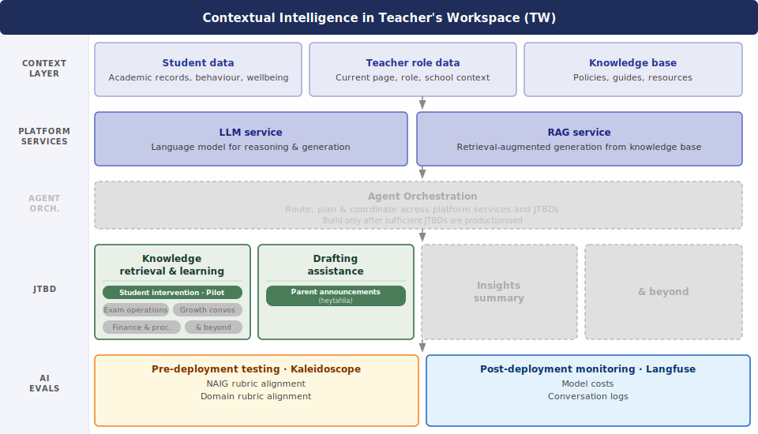

# Contextual Intelligence (CI) Product Strategy

## 💡 What is CI?

CI is the secure Intelligence Layer of our platform — the Educator Productivity Intelligence Gateway.

As the name suggests, CI matches the proprietary MOE context of the teacher, their students, and their scenario, to intelligent services (LLM, RAG etc) to assemble a contextually relevant, grounded response — all within the secure TW environment where sensitive data can be safely used. Rather than requiring teachers to re-enter context or switch between tools, CI handles the entire pipeline behind the scenes and surfaces the right answer, draft, or insight at the point of need.

<table>
<tr>
<td></td>
<td></td>
</tr>
</table>

---

## 🏫 The AI & Teaching Landscape

### In Singapore

- **High AI Appetite:** According to the [OECD TALIS 2024 Survey](https://www.moe.gov.sg/news/press-releases/20251007-singapore-teachers-embrace-digital-technologies-and-benefit-from-strong-professional-development-oecd-talis-2024-study), 3 in 4 Singapore teachers use AI to teach or support learning — more than double the global average of 36%
- **Existing Ecosystem:** All MOE teachers have Google Workspace accounts (giving them native access to Gemini) and actively use government-whitelisted utilities like Pair Chat
- **Top Use Cases:** Topic learning, drafting administrative text, and lesson planning

### Globally

*To be researched. Helpful references:*
- [Google for Education Blog](https://blog.google/products-and-platforms/products/education/)
- [Claude for Education](https://claude.com/solutions/education)
- [ChatGPT for Teachers](https://openai.com/index/chatgpt-for-teachers/)

---

## 🔑 What problem is this solving?

Teachers are dealing with severe admin burnout. [74% agreed that AI helps them automate administrative tasks](https://www.moe.gov.sg/news/press-releases/20251007-singapore-teachers-embrace-digital-technologies-and-benefit-from-strong-professional-development-oecd-talis-2024-study), but lacks access to it due to strict structural barriers:

**The Administrative Burden:** Singapore teachers work an average of [47.3 hours a week](https://www.moe.gov.sg/news/press-releases/20251007-singapore-teachers-embrace-digital-technologies-and-benefit-from-strong-professional-development-oecd-talis-2024-study), with a significant portion consumed by administrative tasks. AI has the potential to reduce this load, but current setups block it.

**System Lock-In & Security:** Because of strict data security policies:
- External AI tools like Gemini are limited to Official (Open) / Non-Sensitive data only
- Internal AI tools like Pair Chat (available to all public servants) are cleared up to Official (Closed) / Sensitive Normal
- Student data is classified as Sensitive High — which immediately eliminates both Pair Chat and external tools for any student-related admin work
- This cuts teachers off from using AI precisely where it would help most

**The "Context Transfer" Tax:** When teachers try to use permitted external tools, they must manually strip out, scrub, and re-enter context across internal platforms and external chat boxes — eroding any time savings gained.

---

## 🏆 Success

Our ultimate North Star metric is measurable time saved for educators. We evaluate success by how effectively our platform capabilities shrink their weekly administrative backlog:

- **Knowledge Retrieval:** Saves time in discovery and information synthesis — removes the friction of finding the right document and scanning dense materials by delivering grounded, accurate answers at the point of need
- **Drafting Assistance:** Saves time in context re-composition and cold-start friction — eliminates "blank-page syndrome" by securely pre-filling institutional context so teachers only have to review, edit, and sign off
- **Insights Summary:** Saves time in data sifting and pattern recognition — cuts out hours of manual analysis by securely surfacing student or cohort trends

---

## 🎯 Our Prioritization Framework

We are in our infancy and cannot prioritize every JTBD. To protect our bandwidth, every proposed feature is filtered through four lenses:

1. **Magnitude of Time Saved:** Does the solution fundamentally move the needle on a teacher's weekly administrative load?

2. **Exclusivity of TW/CI:** Can this job only be fulfilled natively inside Teacher's Workspace? If a teacher can fulfil the task using external tools like Pair Chat or Gemini without facing security boundaries or heavy context-transfer friction, we do not build it.

3. **AI Performance Baseline:** We only deploy AI where it explicitly outperforms traditional UX. A well-designed data dashboard will always beat an AI summary if it helps a teacher understand student insights faster and better. Not every workflow needs AI.

4. **TW Platform Readiness:** Is the relevant TW app or workflow surface built and available for CI to plug into? CI is an intelligence layer, not a standalone product — if the underlying TW app doesn't exist yet, CI cannot be embedded there regardless of use case merit.

---

## 👥 Audience

Teachers operating within the Teacher's Workspace ecosystem.

---

## 🛠️ How are we going to build it?

*Pending technical evaluation — high-level architecture:*

- **Shared Infrastructure:** LLM, RAG services, and knowledge base — built once as a shared platform capability layer, powering AI utilities natively across TW apps
- **Embeddable FE:** UI components that can be embedded into existing TW app surfaces at the point of need
- **Guardrails:** Data classification clearance and AI output evaluations — compliance and quality checks native to the core infrastructure, not bolted on as an afterthought

---

## 🚀 Where we're starting: Pilot Scope

Our first JTBD is **Knowledge Retrieval** — see [PRD](https://github.com/String-sg/tw-context-intelligence/blob/main/prd/TW%20Contextual%20Intelligence%20v1.0%20%E2%80%94%20Capability%20Layer%20+%20Knowledge%20Retrieval%20JTBD.md) — surfacing the right guidance at the moment a teacher needs it, grounded in official MOE materials, delivered in the flow of work without requiring a separate search.

**Pilot use case: SwAN student intervention support** within the SDT student profile page in TW. When a student's signals (long-term absenteeism, SEN, or offence) are detected, CI surfaces contextually relevant guidance to the teacher at the point of need. Teacher queries are answered by an AI chat interface grounded against the SwAN knowledge base via RAG, with source citations on every response.

This pilot scores highly on all four prioritization lenses:
- **Time savings** — teachers currently search across dense, fragmented policy materials for intervention guidance
- **TW/CI exclusivity** — student signal data cannot leave internal systems; an embedded solution is the only viable path
- **AI outperforms static UX** — nuanced, student-specific guidance retrieval cannot be served by a document library or dashboard
- **TW platform readiness** — the SDT student profile page already exists as the integration surface
