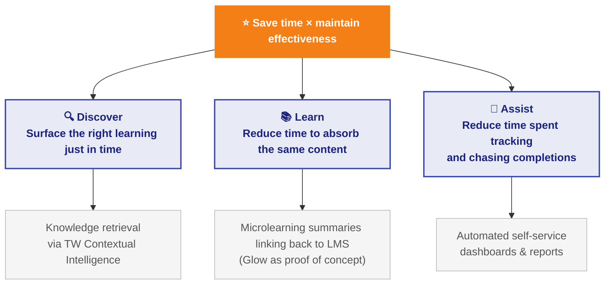

# Learning Product Strategy

---

## Learning Snapshot

_Learning: the process by which individuals acquire knowledge, skills, and competencies._

**What users have**

Tools exist, but are fragmented and disconnected.

- LMS (OPAL 2.0)
- Glow
- COVAA (upcoming)
- Information sites (SharePoint, Google Drive, MOE Intranet)

**Why users learn**

Mostly compliance-driven — voluntary engagement is low.

> [~14% monthly penetration on OPAL](https://app.notion.com/p/moediva/OPAL-EOs-and-EAS-usage-data-20e970a387f280958fd8e4fd96bca273); [Glow sits at ~10%](https://datastudio.google.com/reporting/a8388c20-079c-478d-8147-255f79b9d371). Glow's primary discovery point was compliance-driven content — and it already sits at 10%. OPAL, despite being around for many years, has a similar monthly penetration rate. This suggests OPAL's user base is also largely compliance-driven, and true voluntary engagement across both platforms is likely much lower than headline numbers suggest.

**What users want**

More applied, relevant, and transferable learning.

> [nLDS user research](https://drive.google.com/drive/u/0/folders/1QxQsVP1sqjYvxLIPRSCSZLTJ1xDkLk27) surfaces application, relevancy, transferable skills content, and clearer information architecture as key wants — none addressed by current efforts.

---

## Strategic Bets and Known Gaps

### Known Gaps

**1. Mandate is present but overall nLDS strategy is still forming.**

Professional learning is not explicitly called out in the MFDP paper, but falls under Pillar 1 — empowering teachers. The goal remains the same.

Strategy is still forming due to pending unknowns — the nLDS tender outcome will shape what infrastructure is available and on what timeline. Strategic bets also need to be validated further before we take more formalized steps.

**2. Team resourcing is a constraint.**

TransformX is operating on a combined backlog model, with resources spread across a high volume of priority products. This limits how much we can push on the learning product front simultaneously, and means sequencing and trade-offs will need to be deliberate.

**3. Current efforts don't address the fundamental motivation problem.**

Current nLDS initiatives (LMS replacement, Learn POC) address fragmentation and user experience, but do not touch the more fundamental problem of why teachers don't engage with learning in the first place. The engagement data suggests the bulk of learning activity today is compliance-driven, not intrinsically motivated.

There are three distinct triggers for teacher learning, each requiring a different approach:

| Trigger | Description | Current State |
|------|-------------|---------------|
| **General** | Mostly compliance-driven today. Glow as POC for making compliance learning feel less painful through micro and mobile format | Being solved first — Glow as POC |
| **Contextual (push)** | Learning weaved in the natural JTBD of teachers | High-potential; CI is the near-term bet |
| **Organic (want)** | Teacher chooses to learn on their own terms | Underexplored; remains unaddressed |

Current efforts are focused on making compliance-driven learning feel less painful first. The contextual trigger is next — CI is the near-term bet. The organic trigger remains the open, longer-term question.

---

## A Possible Reimagined Learning North Star

**A possible guiding question:** how do we make learning feel useful to teachers in their daily work, rather than an additional workload on top of it?

**A note on sequencing:** before we can address the deeper question of motivation and delight, we need to first solve the foundation — the quality-of-life issues that make learning feel expensive today. This includes reducing the time investment required, fixing learning modality (shorter, more flexible formats), improving the baseline user experience, and improving learning triggers. Only once that foundation is solid does it make sense to pursue the harder problem of making learning feel genuinely motivating and enjoyable.

---

## Glow Snapshot

Glow has been live since May 2026 as a POC for the general/compliance trigger — making mandatory learning feel less painful through micro and mobile format.

| Metric | What it measures | Cumulative |
|--------|-----------------|------------|
| **Adoption** | % of MOE officers (est. 38,500) who have logged in at least once | 20.65% (7,950 users) |
| **Activeness (MAU)** | Users who engaged with any learning in the past 30 days | 4,428 users |
| **Organic engagement** | % of logged-in users who engaged with non-mandatory content — a proxy for intrinsic motivation | 67.26% (5,347 users) |
| **Retention (WAU/MAU)** | % of monthly active users who return on a weekly basis | 14.84% |
| **Learning effectiveness** | 1st attempt quiz pass rate — using AI Literacy quiz as a proxy; users who passed on first try / all users who attempted | 97% |

_Source: [Glow Analytics Dashboard](https://datastudio.google.com/reporting/a8388c20-079c-478d-8147-255f79b9d371). Data as of Jun 2026._

**Preliminary analysis:** these early numbers proved our hypothesis — AI-summarised content does not hinder learning effectiveness, and actually increases engagement.

---

## Glow Next Steps

Focus is on the targeted content play — being intentional about what content lives in Glow so it is useful rather than just another content repository. Two priority content types:

- **Policy changes** — timely, need-to-know updates that teachers currently find out about too late or through informal channels
- **Product enablement** — learning that supports adoption of MOE tools and platforms (e.g. CaseSync, MySEI)

---

## CI Summary

CI is not scoped to a single use case — it is a platform capability designed to serve multiple teacher JTBDs over time: knowledge retrieval, insights summary, drafting assistance, and more. Current scope is focused on knowledge retrieval.

Anchored in the learning north star, knowledge retrieval directly addresses two fundamental problems in how teachers learn today:

**Discovery — teachers don't know what they don't know.** Learning content is scattered across OPAL, Glow, intranet, and SharePoint. Teachers can only seek out what they're already aware they need, and finding the right thing requires knowing where to look. CI removes the search burden by surfacing the right guide or resource at the moment it's needed — in the flow of work, not as a separate task.

**Learning — catering for how teachers actually learn.** Teachers operate in two modes: a quick productivity mode (extracting information fast to act on immediately) and a deeper learning mode (building understanding over time). CI serves the first mode directly. For the second, it links back to Glow and OPAL — surfacing bite-sized content or full courses when the moment calls for deeper engagement.

---

## CI Next Steps

Development starts July 2026, with target completion by November 2026.

---

## Research Next Steps

To scope with Jessica and Wondo.
